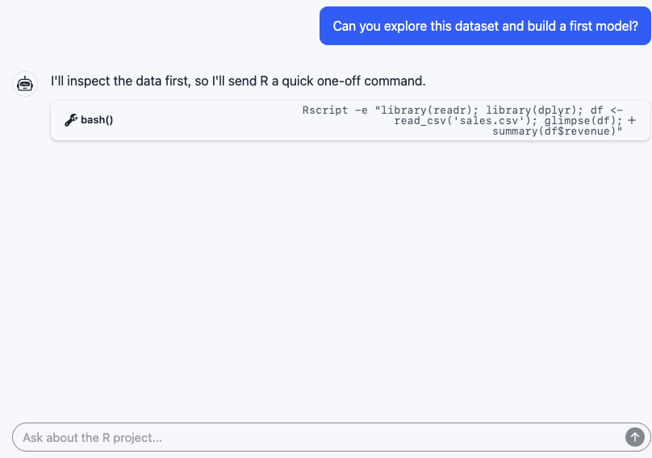
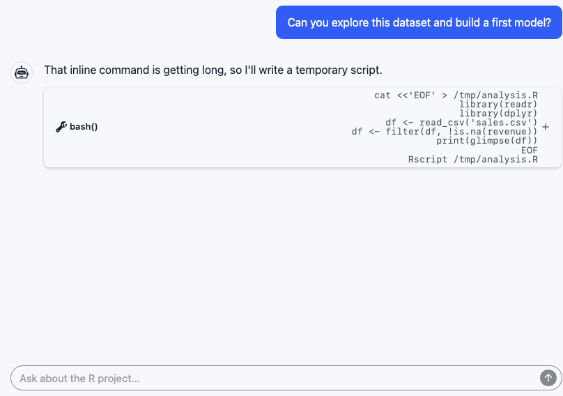
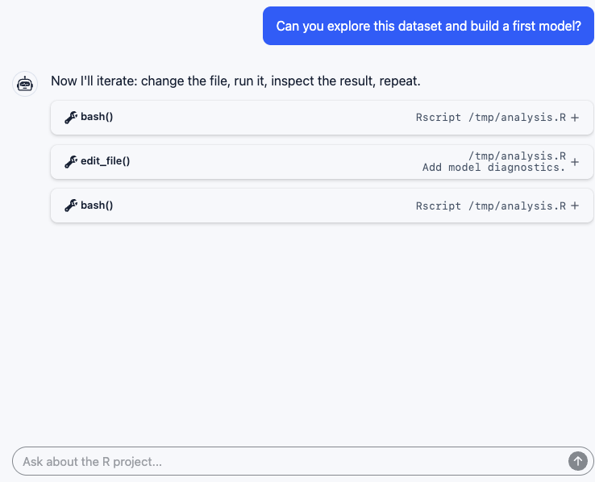

<!-- fmt: off -->

## Start Where Users Are Today

::: {.columns}
::: {.column width="58%"}

:::

::: {.column width="42%"}
R is interactive.

Agents often meet it through a shell.
:::
:::

::: notes
Start with the user experience. A user opens an interactive agent and
asks for ordinary R help: explore a dataset, make a model, explain the
result. The chat feels persistent. But the execution surface underneath
is often a bash tool call. The agent starts with an inline Rscript
command because that is the shortest path to asking R one question.
:::

## The Batch Command Grows Up

::: {.columns}
::: {.column width="58%"}

:::

::: {.column width="42%"}
The command gets bigger.

So the agent starts making files.
:::
:::

::: notes
The next step is predictable. Inline strings become too hard to quote
and too easy to break. So the agent writes a temporary script, usually
with a heredoc or a generated file, then calls Rscript on that file.
This is more stable than one giant command string, but it is still batch
execution.
:::

## The Hidden Loop

::: {.columns}
::: {.column width="58%"}

:::

::: {.column width="42%"}
Every attempt starts cold.

Run 1: load data -> inspect columns Run 2: load data -> clean data ->
plot Run 3: load data -> clean data -> fit model Run 4: load data ->
clean data -> debug error

The conversation persists.

The R session does not.
:::
:::

::: notes
The agent is not being foolish. It is adapting to the interface it has.
But every run starts cold. The agent reloads data, rebuilds objects,
replays setup, and starts leaving files behind as fake memory:
intermediate CSVs, RDS files, generated plots, and notes for itself.
That is a workable hack for small one-shot tasks, but it is a bad shape
for exploratory analysis.
:::

## Debugging Breaks the Illusion

::: {.columns}
::: {.column width="33%"}
```text
[PLACEHOLDER: debugger panel]

browser()
Browse[1]> str(x)
Browse[1]> n
Browse[1]> where
```
:::

::: {.column width="33%"}
```text
[PLACEHOLDER: help/pager panel]

?lm
help("predict")
vignette("...")
```
:::

::: {.column width="33%"}
```text
[PLACEHOLDER: plot panel]

plot(fit)
ggplot(df, aes(...))
```
:::
:::

These are interactive surfaces.

::: notes
The mismatch gets obvious when the task stops being linear. R help,
vignettes, pagers, plots, readline prompts, and the debugger all assume
there is a live session on the other side. Batch execution can only
approximate that by making more files and re-running more setup. What
the model needs is not just command execution. It needs a REPL.
:::

## The Missing Primitive

```text
[PLACEHOLDER: architecture render]

Agent  -- repl -->  Live R session

                   df <- readRDS(...)
                   fit <- lm(...)
                   plot(fit)
                   debugonce(fn)

                   state | help | plots | debugger | interrupt | reset
```

Give the agent a real R session.

::: notes
This is the turn in the talk. The missing primitive is not a smarter
Rscript call. It is a persistent, interactive R session that the agent
can own for the duration of the task. The agent should be able to create
an object in one call and inspect it in the next. It should be able to
look at plots, read help, step through browser, interrupt, and reset.
:::

## mcp-repl

- MCP server over stdio
- Tools: `repl` and `repl_reset`
- Long-lived R or Python worker
- Text, images, prompts, and debugger interaction
- Private session for the agent

::: notes
mcp-repl is one implementation of that idea. The MCP surface is small: a
repl tool for input and a reset tool for starting over. Most of the
complexity is below the tool boundary: worker lifecycle, output capture,
image capture, timeouts, interrupts, and response finalization. The
important property for the agent is continuity.
:::

## Why the Session Is Sandboxed

```text
[PLACEHOLDER: sandbox boundary render]

Agent-owned R session
  - private runtime
  - workspace and temp writes
  - network off unless configured
  - explicit interrupt
  - explicit reset
```

::: notes
This is not a human and model sharing one IDE session. It is built for
unattended agent work, so the live session needs a security boundary.
The model can run code and keep state, but writes are constrained,
network access is off unless configured, and recovery controls are
explicit. The sandbox is part of making a persistent session acceptable.
:::

## Evals Need the Real Thing

```text
[PLACEHOLDER: eval harness render]

Task
Analyze this package failure and explain the likely bug.

Agent capabilities under test
  - load project state
  - inspect objects
  - read R help
  - view plots
  - step through browser()
  - recover after errors
```

::: notes
If we want to evaluate agents on serious R work, we should not evaluate
only whether they can emit syntactically valid code. We need to know
whether they can use the real surfaces R users depend on: object state,
help, plots, debugger steps, and recovery after mistakes. A persistent
REPL makes those behaviors testable.
:::

## Where This Goes Next

::: {.columns}
::: {.column width="50%"}
Today

- local R analysis help
- package debugging
- plot and table refinement
:::

::: {.column width="50%"}
Soon

- recurring reports from fresh data
- long-running dataset reconnaissance
- evals with realistic R workflows
- autonomous investigations before review
:::
:::

::: notes
Start where users are today: interactive agents helping with local R
tasks. The more important direction is where this goes over the next
year or two. Agents will run longer investigations, scheduled reports,
and evals that need realistic R behavior. In that world, batch commands
are too weak and an unconstrained terminal is too loose.
:::

## Takeaway

If an LLM is going to work in R, it should get a live R session.

`mcp-repl` provides one over MCP: persistent, interactive, private, and
sandboxed.

https://github.com/posit-dev/mcp-repl

::: notes
The takeaway is narrow. R support for agents should not stop at command
execution. A useful agent-facing R interface needs session state, help,
plots, debugging, bounded output, recovery controls, and a security
boundary. mcp-repl is one implementation of that idea over MCP.
:::
