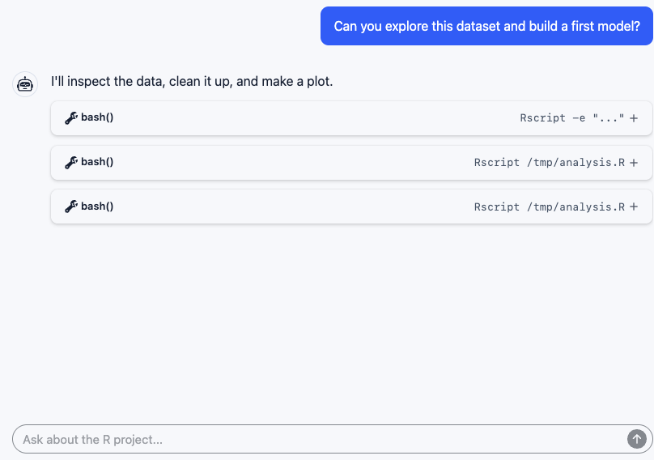

## A Familiar Request

::: {.columns}
::: {.column width="58%"}

:::

::: {.column width="42%"}
R is interactive.

Often, the first bridge is a shell.
:::
:::

::: notes
Timing: ~0:20.

A user asks for ordinary R help: explore this dataset, make a first
model, explain what you find. The chat looks persistent. The agent can
remember the request and reason across turns. But underneath that chat,
the first execution surface is often just a shell command. For R, that
usually means `Rscript`.
:::

## The First Answer Is Batch

::: {.columns}
::: {.column width="58%"}

:::

::: {.column width="42%"}
The shortest path works.

Ask R one question.

Return one answer.
:::
:::

::: notes
Timing: ~0:18.

This is a reasonable starting point. An inline `Rscript -e` call is
available almost everywhere. It is easy for the agent to generate and
easy for the host to run. For a one-line calculation, it is enough. The
problem is that real analysis does not stay one line for very long.
:::

## Then the Script Appears

::: {.columns}
::: {.column width="58%"}

:::

::: {.column width="42%"}
The command gets longer.

Quoting gets fragile.

The agent starts writing files.
:::
:::

::: notes
Timing: ~0:20.

The next step is also predictable. The inline expression turns into a
temporary script. The agent writes a file, runs `Rscript`, reads the
output, edits the file, and runs it again. This is more stable than one
huge shell string, but it is still batch execution wearing an
interactive costume.
:::

## The Cold-Start Loop

::: {.columns}
::: {.column width="58%"}

:::

::: {.column width="42%"}
Every attempt starts cold.

```text
Run 1: load -> inspect
Run 2: load -> clean -> plot
Run 3: load -> clean -> fit
Run 4: load -> clean -> debug
```

The conversation persists.

The R session does not.
:::
:::

::: notes
Timing: ~0:25.

The agent is adapting to the interface it has. But every run starts
cold. It reloads data, rebuilds objects, replays setup, and leaves files
behind as fake memory: intermediate CSVs, RDS files, generated plots,
and notes for itself. That can work for small one-shot tasks. It is the
wrong shape for exploratory analysis.
:::

## R Is Interactive at the Edges

::: {.columns}
::: {.column width="33%"}
```text
Debugger
browser()
Browse[1]> str(x)
Browse[1]> n
Browse[1]> where
```
:::

::: {.column width="33%"}
```text
Help and pager
?lm
help("predict")
vignette("...")
```
:::

::: {.column width="33%"}
```text
Plots
plot(fit)
ggplot(df, aes(...))
```
:::
:::

These are interactive surfaces.

::: notes
Timing: ~0:25.

The mismatch becomes obvious when the task stops being linear. R help,
vignettes, pagers, plots, readline prompts, and the debugger all assume
there is a live session on the other side. Batch execution can only
approximate that by making more files and replaying more setup. For
serious R work, command execution is not the primitive we need.
:::

## The Missing Primitive

```text
Agent
  |
  | repl
  v
Live R session

df <- readRDS(...)
fit <- lm(...)
plot(fit)
debugonce(fn)

state | help | plots | debugger | interrupt | reset
```

Give the agent a real R session.

::: notes
Timing: ~0:25.

The missing primitive is not a smarter `Rscript` call. It is a
persistent, interactive R session that the agent can own for the length
of the task. The agent should be able to create an object in one call
and inspect it in the next. It should be able to view plots, read help,
step through `browser()`, interrupt bad work, and reset when it needs a
clean slate.
:::

## mcp-repl

- MCP server over stdio
- Tools: `repl` and `repl_reset`
- Long-lived R or Python worker
- Text, images, prompts, and debugger interaction
- Private session for the agent

::: notes
Timing: ~0:25.

`mcp-repl` is one implementation of that idea. The MCP surface is small:
a `repl` tool for input and a `repl_reset` tool for starting over. The
hard parts sit below that boundary: worker lifecycle, output capture,
image capture, timeouts, interrupts, and response finalization. The
user-visible property is continuity.
:::

## Keep the Session in a Box

```text
Agent-owned R session
  - private runtime state
  - explicit interrupt
  - explicit reset

Sandbox
  - workspace and temp writes only
  - network off unless configured
```

::: notes
Timing: ~0:25.

This is not a human and a model sharing one IDE session. It is built for
agent work, so the live session needs a security boundary. The model can
run code and keep state, but writes are constrained, network access is
off unless configured, and recovery controls are explicit. The sandbox
is part of what makes persistence acceptable.
:::

## When No One Is Sitting There

::: {.columns}
::: {.column width="50%"}
**Unattended sessions**

- scheduled jobs
- fresh-data reconnaissance
- overnight failure analysis
- autonomous report drafts
:::

::: {.column width="50%"}
**Workflow optimization**

- evals on realistic R tasks
- prompt and policy sweeps
- regression tests for tool use
- LLM-powered pipeline tuning
:::
:::

::: notes
Timing: ~0:35.

This is the future-facing gap. The same primitive matters when there is
not a human watching every turn: scheduled work, long-running
investigations, agent evaluations, and optimization loops that tune
prompts, tools, or analysis workflows. A human may review the result,
but the session itself is owned by the agent while the work is
happening.
:::

## Evaluate the Real Workflow

```text
Task
Analyze this package failure and explain the likely bug.

Agent capabilities under test
  - load project state
  - inspect objects
  - read R help
  - view plots
  - step through browser()
  - recover after errors
```

::: notes
Timing: ~0:30.

If we want to evaluate agents on serious R work, we should not only ask
whether they can emit syntactically valid code. We should ask whether
they can use the surfaces R users actually depend on: object state,
help, plots, debugger steps, and recovery after mistakes. A persistent
REPL makes those behaviors observable and testable.
:::

## Two Different Shapes

```{r}
#| label: two-session-shapes
#| echo: false
#| fig-width: 13.5
#| fig-height: 6
#| fig-bg: "#191919"
#| out-width: "100%"
bg <- "#191919"
fg <- "#f6f7fb"
muted <- "#c8d3dc"
panel <- "#2f3944"
code_fill <- "#29323d"
blue <- "#9ee7ff"
blue_muted <- "#6c8795"
blue_fill <- "#17212b"
green <- "#b8f5b0"
green_fill <- "#1f251f"

par(
  mar = c(0, 0, 0, 0),
  pty = "m",
  xaxs = "i",
  yaxs = "i",
  bg = bg,
  family = "sans"
)
plot.new()
plot.window(xlim = c(0, 100), ylim = c(0, 60))
rect(0, 0, 100, 60, col = bg, border = NA)

x_unit <- par("pin")[1] / diff(par("usr")[1:2])
y_unit <- par("pin")[2] / diff(par("usr")[3:4])
person_radius <- 3.35

draw_box <- function(x0, y0, x1, y1, label, fill, border, cex = 1.05) {
  rect(x0, y0, x1, y1, col = fill, border = border, lwd = 2.6)
  text((x0 + x1) / 2, (y0 + y1) / 2, label, col = fg, cex = cex, font = 2)
}

draw_code <- function(x, y, label, cex) {
  stopifnot(is.character(label), length(label) == 1, cex > 0)
  width <- strwidth(label, units = "user", cex = cex, font = 2, family = "mono")
  height <- strheight(
    label,
    units = "user",
    cex = cex,
    font = 2,
    family = "mono"
  )
  rect(
    x - width / 2 - 0.55,
    y - height / 2 - 0.42,
    x + width / 2 + 0.55,
    y + height / 2 + 0.42,
    col = code_fill,
    border = NA
  )
  text(x, y, label, col = fg, cex = cex, font = 2, family = "mono")
}

draw_inline_code_label <- function(x, y, code, suffix, cex = 1.35) {
  stopifnot(is.character(suffix), length(suffix) == 1)
  code_width <- strwidth(
    code,
    units = "user",
    cex = cex,
    font = 2,
    family = "mono"
  )
  suffix_width <- strwidth(suffix, units = "user", cex = cex, font = 2)
  code_outer_width <- code_width + 1.1
  gap <- 0.12
  left <- x - (code_outer_width + gap + suffix_width) / 2
  draw_code(left + code_outer_width / 2, y, code, cex)
  text(
    left + code_outer_width + gap,
    y,
    suffix,
    col = fg,
    cex = cex,
    font = 2,
    adj = c(0, 0.5)
  )
}

draw_mcp_repl_box <- function(x0, y0, x1, y1, fill, border, cex = 0.95) {
  rect(x0, y0, x1, y1, col = fill, border = border, lwd = 2.6)
  draw_code((x0 + x1) / 2, (y0 + y1) / 2 + 1.45, "mcp-repl", cex = cex)
  text(
    (x0 + x1) / 2,
    (y0 + y1) / 2 - 2.05,
    "R session",
    col = fg,
    cex = cex,
    font = 2
  )
}

draw_person <- function(x, y, border) {
  symbols(
    x,
    y,
    circles = person_radius,
    inches = FALSE,
    add = TRUE,
    fg = border,
    bg = bg,
    lwd = 2.8
  )
  symbols(
    x,
    y + 1.15,
    circles = 0.9,
    inches = FALSE,
    add = TRUE,
    fg = border,
    bg = bg,
    lwd = 2.4
  )
  shoulder_x <- seq(-1.95, 1.95, length.out = 32)
  shoulder_y <- -1.8 + 0.9 * sqrt(pmax(0, 1 - (shoulder_x / 1.95)^2))
  lines(x + shoulder_x, y + shoulder_y, col = border, lwd = 2.4, lend = "round")
  text(x, y - 5.25, "Human", col = fg, cex = 0.8, font = 2)
}

draw_arrow_between <- function(from, to, col, start_gap, end_gap, arrow) {
  stopifnot(length(from) == 2, length(to) == 2)
  dx <- to[1] - from[1]
  dy <- to[2] - from[2]
  data_distance <- sqrt(dx^2 + dy^2)
  visual_distance <- sqrt((dx * x_unit)^2 + (dy * y_unit)^2)
  stopifnot(
    start_gap >= 0,
    end_gap >= 0,
    arrow$shaft_length > 0,
    arrow$edge_gap >= 0,
    arrow$head_length > 0,
    arrow$lwd > 0,
    is.character(arrow$lty),
    length(arrow$lty) == 1,
    data_distance > 0,
    visual_distance > 0
  )
  start_fraction <- start_gap / data_distance
  end_fraction <- 1 - end_gap / data_distance
  edge_gap_fraction <- arrow$edge_gap / visual_distance
  arrow_start <- start_fraction + edge_gap_fraction
  arrow_end <- end_fraction - edge_gap_fraction
  actual_shaft_length <- visual_distance * (arrow_end - arrow_start)
  stopifnot(
    arrow_start < arrow_end,
    isTRUE(all.equal(
      actual_shaft_length,
      arrow$shaft_length,
      tolerance = 1e-3
    ))
  )
  arrows(
    from[1] + arrow_start * dx,
    from[2] + arrow_start * dy,
    from[1] + arrow_end * dx,
    from[2] + arrow_end * dy,
    length = arrow$head_length,
    angle = 24,
    code = 3,
    col = col,
    lwd = arrow$lwd,
    lty = arrow$lty
  )
}

circle_edge_gap <- function(from, to, radius) {
  dx <- to[1] - from[1]
  dy <- to[2] - from[2]
  data_distance <- sqrt(dx^2 + dy^2)
  visual_distance <- sqrt((dx * x_unit)^2 + (dy * y_unit)^2)
  stopifnot(visual_distance > 0)
  data_distance * radius * x_unit / visual_distance
}

box_edge_gap <- function(from, to, half_width, half_height) {
  dx <- to[1] - from[1]
  dy <- to[2] - from[2]
  distance <- sqrt(dx^2 + dy^2)
  stopifnot(distance > 0)
  x_scale <- if (dx == 0) Inf else half_width / abs(dx)
  y_scale <- if (dy == 0) Inf else half_height / abs(dy)
  distance * min(x_scale, y_scale)
}

agent_arrow <- list(
  shaft_length = 0.60,
  edge_gap = 0.08,
  head_length = 0.10,
  lwd = 2.8,
  lty = "solid"
)
optional_agent_arrow <- list(
  shaft_length = 0.60,
  edge_gap = 0.08,
  head_length = 0.10,
  lwd = 2.4,
  lty = "22"
)
ide_arrow <- list(
  shaft_length = 1.00,
  edge_gap = 0.16,
  head_length = 0.11,
  lwd = 2.8,
  lty = "solid"
)

rect(c(2, 52), 7, c(48, 98), 53, border = panel, col = NA, lwd = 1.8)
draw_inline_code_label(25, 49.5, "mcp-repl", ": agent-owned")
text(
  75,
  49.5,
  "Posit Assistant: human in the loop",
  col = fg,
  cex = 1.35,
  font = 2
)
text(
  c(25, 75),
  c(13, 10.7),
  c(
    "Human can trigger or review; session can run unattended.",
    "Human, agent, and REPL remain connected."
  ),
  col = muted,
  cex = c(0.91, 0.98)
)

agent_open <- agent_arrow$shaft_length + 2 * agent_arrow$edge_gap
agent_harness <- c(25, 31)
agent_human <- c(
  agent_harness[1] - (agent_open / x_unit + person_radius + 7),
  31
)
agent_repl <- c(agent_harness[1] + agent_open / x_unit + 7 + 5, 31)
draw_arrow_between(
  agent_human,
  agent_harness,
  blue_muted,
  start_gap = circle_edge_gap(agent_human, agent_harness, person_radius),
  end_gap = box_edge_gap(agent_harness, agent_human, 7, 4.5),
  arrow = optional_agent_arrow
)
draw_arrow_between(
  agent_harness,
  agent_repl,
  blue,
  start_gap = box_edge_gap(agent_harness, agent_repl, 7, 4.5),
  end_gap = box_edge_gap(agent_repl, agent_harness, 5, 6.2),
  arrow = agent_arrow
)
draw_person(agent_human[1], agent_human[2], blue_muted)
draw_box(18, 26.5, 32, 35.5, "LLM harness", blue_fill, blue)
draw_mcp_repl_box(37, 24.8, 47, 37.2, blue_fill, blue)

ide_open <- ide_arrow$shaft_length + 2 * ide_arrow$edge_gap
triangle_top_y <- 41.5
triangle_left <- c(62, triangle_top_y)
triangle_right <- c(
  triangle_left[1] + ide_open / x_unit + person_radius + 8.2,
  triangle_top_y
)
triangle_bottom <- c(71.70876, 22.78294)

draw_arrow_between(
  triangle_left,
  triangle_right,
  green,
  start_gap = circle_edge_gap(triangle_left, triangle_right, person_radius),
  end_gap = box_edge_gap(triangle_right, triangle_left, 8.2, 4.4),
  arrow = ide_arrow
)
draw_arrow_between(
  triangle_right,
  triangle_bottom,
  green,
  start_gap = box_edge_gap(triangle_right, triangle_bottom, 8.2, 4.4),
  end_gap = box_edge_gap(triangle_bottom, triangle_right, 8.8, 4.2),
  arrow = ide_arrow
)
draw_arrow_between(
  triangle_bottom,
  triangle_left,
  green,
  start_gap = box_edge_gap(triangle_bottom, triangle_left, 8.8, 4.2),
  end_gap = circle_edge_gap(triangle_left, triangle_bottom, person_radius),
  arrow = ide_arrow
)
draw_person(triangle_left[1], triangle_left[2], green)
draw_box(
  triangle_right[1] - 8.2,
  triangle_right[2] - 4.4,
  triangle_right[1] + 8.2,
  triangle_right[2] + 4.4,
  "LLM harness",
  green_fill,
  green
)
draw_box(
  triangle_bottom[1] - 8.8,
  triangle_bottom[2] - 4.2,
  triangle_bottom[1] + 8.8,
  triangle_bottom[2] + 4.2,
  "IDE R session",
  green_fill,
  green,
  cex = 0.98
)
```

::: notes
Timing: ~0:45.

These are different shapes. With `mcp-repl`, a human may trigger or
review work, but the LLM harness owns the live connection to `mcp-repl`,
and the session can also run unattended. There is no direct line from a
human to that R session. It is private runtime owned by the agent. The
IDE experience is different: the human, the assistant, and the R session
are connected, so it is designed for interactive, agent-assisted data
analysis.
:::

## Posit AI

::: {.columns}
::: {.column width="50%"}
**mcp-repl**

- open source
- agent-owned sessions
- works with external LLM harnesses
- better than shell-only R access
:::

::: {.column width="50%"}
**Posit Assistant**

- built into the IDE experience
- human, agent, and R stay connected
- designed for interactive data analysis
- the richer human-in-the-loop path
:::
:::

::: notes
Timing: ~0:25.

The closing distinction is that `mcp-repl` is for agents. It is open
source, and it helps external harnesses use R more effectively than raw
shell commands. Posit AI is the product path for the integrated
experience: the IDE has the assistant and the R session in the same
human-in-the-loop environment.
:::

## Takeaway

If an agent is going to work in R, it should get a live R session.

`mcp-repl` is the open source, agent-facing path: persistent,
interactive, private, and sandboxed.

For interactive work with a human in the loop, use Posit Assistant in
the integrated IDE experience.

https://github.com/posit-dev/mcp-repl

::: notes
Timing: ~0:20.

The takeaway is narrow: R support for agents should not stop at command
execution. For agent-owned sessions, `mcp-repl` provides that interface
over MCP. For human-in-the-loop interactive analysis, the better shape
is the integrated Posit AI assistant experience in the IDE.
:::
